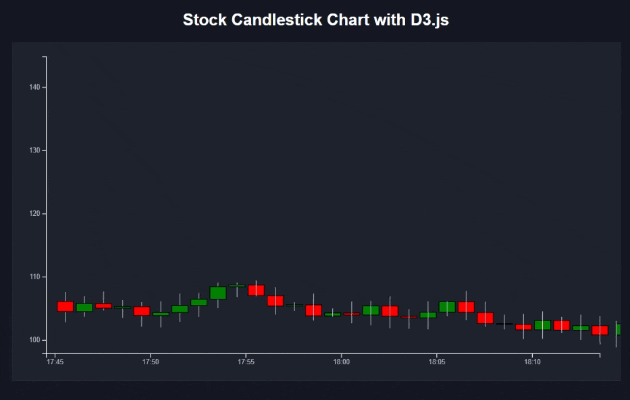

# 📈 Dynamic TradingView-Style Candlestick Chart with D3.js

## 📝 Overview
This project is a **fully interactive candlestick chart** built with **D3.js**, designed to mimic the behavior of **TradingView charts**. It features **real-time updates**, **smooth animations**, and a **dynamic zooming experience**, making it an ideal starting point for anyone interested in **financial data visualization**.

The chart generates **random market data**, ensuring **open-close consistency**, and dynamically **adapts the x-axis time range** based on zoom level. The number of candles displayed **remains fixed at 30**, but zooming reveals more granular timeframes (e.g., from 4-hour candles down to 1-minute candles).

---

## 🎯 Features
✅ **Dynamic zooming & panning** – Zoom out to see 4-hour candles, zoom in for minutely details  
✅ **Smooth leftward scrolling** – New candles push old ones left instead of reloading  
---

##🔥 Future Enhancements

🔹 Live API Data → Connect to a real stock market API (e.g., Binance, Alpha Vantage).

🔹 Indicators → Add moving averages, RSI, Bollinger Bands for analysis.

🔹 Custom Timeframes → Allow users to select 1m, 5m, 15m, 1H views.

